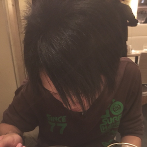

# Yutaro Muta / 牟田 裕太郎

## コンタクト

* Email: yutailang0119@gmail.com
* Twitter: [@yutailang0119](https://twitter.com/yutailang0119)
* GitHub: [yutailang0119](https://github.com/yutailang0119)
* Facebook: [muta.yutaro](https://facebook.com/muta.yutaro)
* LinkedIn: [yutailang0119](https://www.linkedin.com/in/yutailang0119)

## 他アカウント

* Blog: [yutailang0119.hatenablog.com](http://yutailang0119.hatenablog.com)
* Qiita: [yutailang0119](https://qiita.com/yutailang0119)
* Speaker Deck: [yutailang0119](https://speakerdeck.com/yutailang0119)

## 略歴

| 年月 | |
|:--|:--|
| 2011年4月 | [国立大学法人 電気通信大学](http://www.uec.ac.jp) 情報理工学部 先進理工学科 入学 |
| 2014年9月 | [アライドアーキテクツ株式会社](http://www.aainc.co.jp) インターンシップ |
| 2015年3月 | 国立電気通信大学 情報理工学部 先進理工学科 卒業 |
| 2015年4月 | アライドアーキテクツ株式会社 入社 |
| 2017年5月 | GreenSnap事業譲渡に伴い、株式会社大都 転籍 |
| 2017年5月 | [GreenSnap株式会社](https://greensnap.jp/news/company) 出向 |
| 2018年2月 | 株式会社大都/GreenSnap株式会社 退職 |
| 2018年2月 | [株式会社はてな](http://hatenacorp.jp) 入社 |

## 活動

### カンファレンススタッフ

| カンファレンス | ポジション | info |
|:--|:--|:--|
| [PyCon JP 2016](https://pycon.jp/2016/en/) | [コアスタッフ](https://pycon.jp/2016/en/about/staff-list/) | [PyCon JP 2016開催しました！ / LTやってきた #pyconjp](http://yutailang0119.hatenablog.com/entry/2016/09/24/180000) |
| [builderscon 2016 tokyo](https://builderscon.io/builderscon/tokyo/2016) | スタッフ | [builderscon tokyo 2016にボランティアスタッフ参加しました #builderscon](http://yutailang0119.hatenablog.com/entry/2016/12/06/135248) |
| [try! Swift Tokyo 2017](https://www.tryswift.co/events/2017/tokyo/en/) | [スタッフ](https://blog.tryswift.co/try-Swift-Tokyo-2017) | [try! Swift tokyo 2017に参加 / ボランティアスタッフしました #tryswiftconf](http://yutailang0119.hatenablog.com/entry/tryswiftconf-2017) |
| [builderscon 2017 tokyo](https://builderscon.io/tokyo/2017) | コアスタッフ | [ブログを書くまでがbuilderscon 2017 tokyoです #builderscon](http://yutailang0119.hatenablog.com/entry/builderscon-2017-tokyo) |
| [PyCon JP 2017](https://pycon.jp/2017/en/) | [コアスタッフ](https://pycon.jp/2017/en/about/staff-list/) | [ブログを書くまでがPyCon JP 2017です #pyconjp](http://yutailang0119.hatenablog.com/entry/pycon-jp-2017) |
| [iOSDC JAPAN 2017](https://iosdc.jp/2017/) | スタッフ | [ブログを書くまでがiOSDC JAPAN 2017です！ #iosdc](http://yutailang0119.hatenablog.com/entry/iosdc-japan-2017) |
| [builderscon 2018 tokyo](https://builderscon.io/tokyo/2018) | コアスタッフ | [builderscon tokyo 2018のスタッフ & LT登壇しました #builderscon](https://yutailang0119.hatenablog.com/entry/builderscon-tokyo-2018) |
| [Y8 in 城](https://y8-20180929-shiro.hachiojipm.org) | 当日ボランティア | [Y8 in 城でDepthカメラの話をしました #shiro929](https://yutailang0119.hatenablog.com/entry/y8-in-castle) |
| [try! Swift Tokyo 2019](https://www.tryswift.co/events/2019/tokyo/) | [Organizer](https://www.tryswift.co/events/2019/tokyo/en/#yutailang0119) |  |
| [builderscon 2019 tokyo](https://builderscon.io/tokyo/2019) | サポートスタッフ |  |
| [try! Swift Tokyo 2020](https://www.tryswift.co/events/2020/tokyo/) | [Organizer](https://www.tryswift.co/events/2020/tokyo/en/#yutailang0119) | [COVID-19により中止](https://www.tryswift.co/events/2020/tokyo/jp/) |
| [SPAJAM 2021](https://history.spajam.jp/2021/) | 運営スタッフ |  |
| [SPAJAM 2022](https://www.spajam.jp) | 運営スタッフ |  |

### 執筆

* [PyCon JP 2016 開催後レポート ～第3回 メディアチームのPyCon JP 2016](https://codezine.jp/article/detail/9852)
* [WEB+DB PRESS Vol.101](http://gihyo.jp/magazine/wdpress/archive/2017/vol101)
    * builderscon 2017 tokyo イベントレポート
* [WEB+DB PRESS Vol.116](https://gihyo.jp/magazine/wdpress/archive/2020/vol116)
    * 特集1 はじめてのトラブルシューティング
        * 第4章：モバイルアプリ リリース作業，クラッシュエラー対応，起動の高速化
* [Offers Magazine コミュニティから繋がる、iOSアプリエンジニアの副業とキャリアの築き方](https://offers.jp/media/sidejob/workstyle/a_1855)
* [WEB+DB PRESS Vol.121](https://gihyo.jp/magazine/wdpress/archive/2021/vol121)
    * 特集2 UIKit，SwiftUI，iPadOS，ウィジェット iOS 14最前線
        * 第2章：UIKitによるアプリ開発 進化したPicker，Menu，CollectionViewを使う
        * 第5章：ウィジェットの開発 アプリ内のコンテンツをホーム画面で提供する

### 受賞歴

* [SPAJAM 2020](https://spajam.jp/2020/) 最優秀賞 チーム「おひっこし」
    * [第2回予選大会](https://spajam.jp/competition-result2) 優秀賞「イマージ」
        * [SPAJAM 2020 第2回予選大会に「おひっこし」として参加して、優秀賞に選ばれました #SPAJAM](https://yutailang0119.hatenablog.com/entry/spajam-2020-qualifying)
    * [本選](https://spajam.jp/final-result) 最優秀賞「ぽすすめ」
        * [SPAJAM 2020 本選大会に「おひっこし」として参加して、最優秀賞に選ばれました！！！ #SPAJAM](https://yutailang0119.hatenablog.com/entry/spajam-2020-final)

## 資格

| 取得年月 | 資格名  |
|:--|:--|
| 2015年3月 | 高等学校教諭一種免許状 (理科) |

